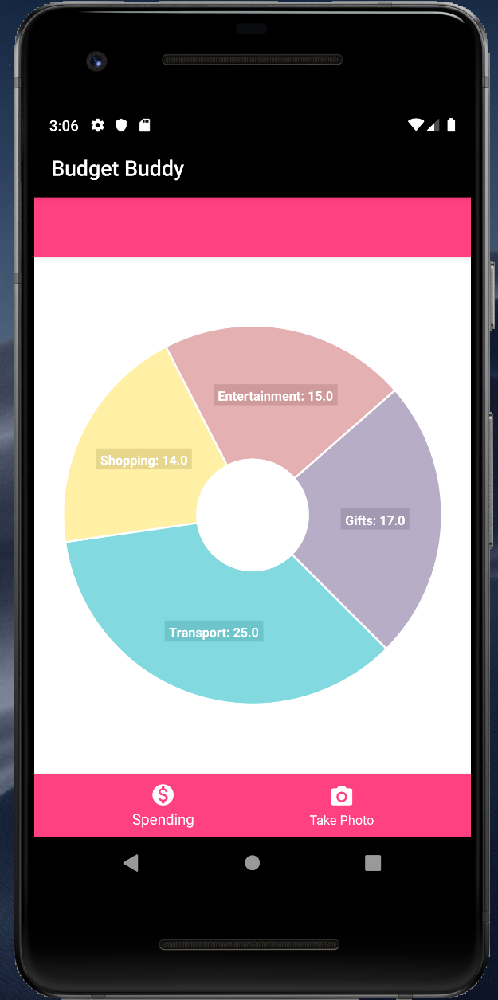
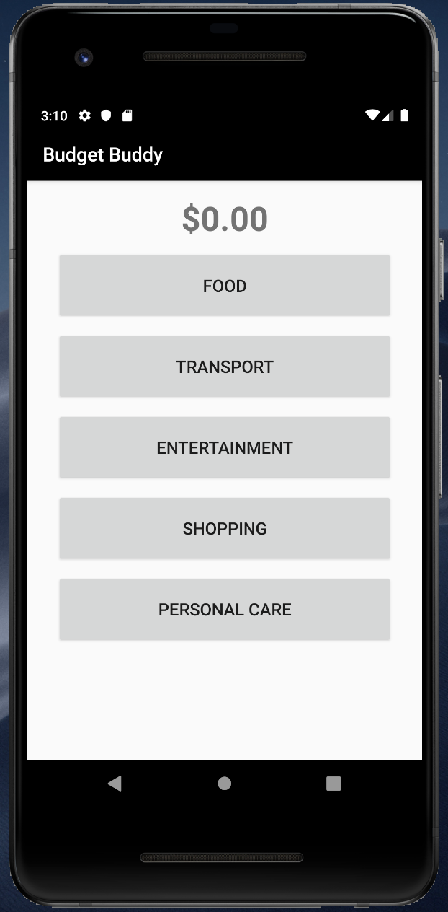

# Budget Buddy
An Android mobile app built for Hack the 6ix. We designed this app to assist users with budgeting by using AI/OCR to analyze receipts. The user takes a picture of the receipt, and the image gets processed by Textract which will parse out the prices. The user can then categorize purchases, and Budget Buddy will provide a chart showcasing the user's expenditures.

     

## Tools Used:
- Android Studio
- AWS Textract
- AWS Amplify
- AWS DynamoDB

## Potential Long-term Add-ons:
- Integrate AWS Comprehend to leverage NLP for categorization
- Implement robust budget indicators (approaching targets/meeting goals)
